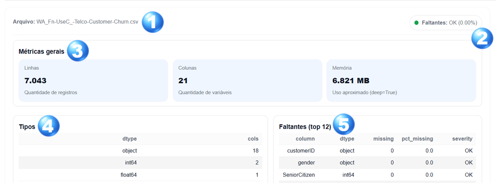
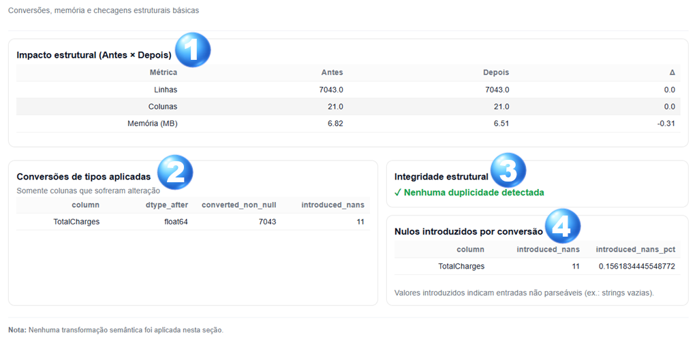
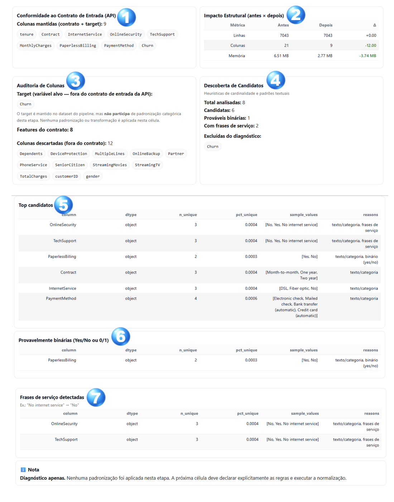

# Pipeline Principal — ChurnInsight
Este notebook representa o **pipeline operacional do projeto ChurnInsight**, apresentando de forma **visual, progressiva e narrativa** o fluxo completo de análise de dados — desde a ingestão até a preparação para modelagem.
O objetivo principal deste pipeline é **tornar explícito o estado atual dos dados em cada etapa**, permitindo que o leitor compreenda:
- qual dado está sendo utilizado,
- em que condição ele se encontra,
- e quais decisões técnicas serão tomadas.

---
## Como ler este pipeline

- O pipeline é organizado em **seções numeradas**, exibidas sequencialmente
- Cada seção contém **elementos visuais e indicadores técnicos**
- O foco aqui é **compreensão do fluxo**, não implementação de código
- A lógica técnica detalhada de cada elemento está documentada separadamente no documento de referência técnica

📎 [pipeline_elements.md](./pipeline_elements.md)

> 📌 Sempre que um elemento aparecer neste notebook, ele possui uma definição técnica correspondente no documento de referência.

---
## Estrutura geral do pipeline

O pipeline está dividido em grandes blocos conceituais:

1. **Ingestão e diagnóstico inicial**  
   Identificação da fonte de dados e avaliação básica de qualidade.

2. **Qualidade Estrutural & Tipagem**  
   Ajustes técnicos controlados (conversões, memória e checagens estruturais).

3. **Pré-processamento orientado à modelagem**  
   Aplicação de contrato (API) + diagnóstico categórico para orientar padronização.

Cada seção é construída para tornar **explícito** o estado dos dados e as decisões técnicas implícitas, garantindo que o avanço no pipeline ocorra com base em informações verificáveis.

---
## Princípio de Transformações Reversíveis vs Irreversíveis

Este pipeline distingue explicitamente entre dois tipos de operações:

### 🔁 Operações Reversíveis (Diagnóstico e Auditoria)
- Não alteram semanticamente o dataset
- Servem para inspeção, validação e tomada de decisão
- Podem ser executadas múltiplas vezes sem impacto cumulativo

Exemplos:
- Diagnóstico de qualidade
- Avaliação de impacto estrutural
- Descoberta de candidatos categóricos
- Auditorias e relatórios

Essas operações **não consolidam alterações no estado final dos dados**.

### 🔒 Operações Irreversíveis (Transformações Assumidas)
- Alteram o estado definitivo do dataset
- Exigem decisão explícita e rastreável
- São executadas apenas após validação técnica e semântica

Exemplos:
- Aplicação do contrato da API
- Padronização categórica
- Tratamento de dados faltantes
- Encoding e normalização para modelagem

Cada operação irreversível é documentada e executada apenas quando seu impacto é plenamente compreendido.

---
# 1️⃣ Seção 1 — Ingestão
Esta seção marca o **ponto de entrada do pipeline**.

Seu papel é responder, de forma clara e imediata, às seguintes perguntas:

- Qual arquivo está sendo utilizado?
- Os dados estão completos?
- Há problemas estruturais evidentes?
- O dataset está apto para avançar no pipeline?

Os elementos exibidos a seguir **não realizam transformações** —  
eles **descrevem o estado atual dos dados** logo após a ingestão.

---
## Elementos da Seção 1 — Ingestão
Cada item abaixo possui uma descrição técnica detalhada no documento de referência:

📎 [pipeline_elements.md — Seção 1 (início)](./pipeline_elements.md#s11-elemento-arquivo)

---

<!-- Âncora visual canônica da Seção 1 -->

  

  <em>
    Visão geral dos cards da Seção 1 (Ingestão e Diagnóstico Inicial), com
    indexação visual utilizada como referência ao longo desta seção.
  </em>

---
### 1️⃣ Elemento — Arquivo

Indica qual arquivo de dados bruto está sendo utilizado como fonte ativa do pipeline, garantindo rastreabilidade entre o notebook e a origem física dos dados.

**Referência técnica:**  
[S1.1 — Elemento: Arquivo](./pipeline_elements.md#s11-elemento-arquivo)

---
### 2️⃣ Indicador — Faltantes (Global)

Apresenta uma visão consolidada da presença de valores ausentes no dataset, funcionando como um indicador inicial de qualidade dos dados e sinalizando severidade de forma resumida.

**Referência técnica:**  
[S1.2 — Indicador: Faltantes (Global)](./pipeline_elements.md#s12-indicador-faltantes-global)

---
### 3️⃣ Card — Métricas gerais

Exibe métricas estruturais básicas do dataset (volume de registros, colunas e memória), oferecendo uma visão imediata da dimensão dos dados ingeridos.

**Referência técnica:**  
[S1.3 — Card: Métricas gerais](./pipeline_elements.md#s13-card-metricas-gerais)

---
### 4️⃣ Card — Tipos de dados

Resume a distribuição dos tipos de dados presentes no dataset, apoiando o entendimento estrutural e antecipando decisões de pré-processamento.

**Referência técnica:**  
[S1.4 — Card: Tipos de dados](./pipeline_elements.md#s14-card-tipos-de-dados)

---
### 5️⃣ Card — Faltantes (top N)

Lista as colunas com maior incidência de valores ausentes, permitindo identificar rapidamente pontos críticos e priorizar intervenções futuras.

**Referência técnica:**  
[S1.5 — Card: Faltantes (top N)](./pipeline_elements.md#s15-card-faltantes-top-n)

---
### Observação geral da seção

Os elementos desta seção **não alteram o dataset**.  
Eles estabelecem um **ponto de referência inicial**, sobre o qual as decisões técnicas das etapas seguintes serão fundamentadas.

---
# 2️⃣ Seção 2 — Qualidade Estrutural & Tipagem

### [S2.pre] Execução técnica — diagnóstico estrutural
Etapa não visual responsável por executar diagnósticos de tipos, nulos e duplicatas.
Nenhuma transformação irreversível é aplicada.

---

Esta seção aprofunda a análise do dataset já ingerido, com foco na **integridade estrutural** após conversões e validações técnicas básicas.

Diferente da Seção 1, aqui o objetivo é tornar explícitos **impactos técnicos reais** decorrentes de ajustes necessários para o avanço seguro do pipeline.

As ações desta seção **não aplicam transformações semânticas** nem decisões de negócio.  
Elas se concentram em garantir que o dataset esteja **tecnicamente consistente**, bem tipado e livre de problemas estruturais críticos.

---
### O que esta seção responde

Ao final desta etapa, o pipeline deve ser capaz de responder com clareza:

- O dataset sofreu alterações estruturais após conversões?
- Quais colunas tiveram seus tipos ajustados?
- As conversões introduziram novos valores ausentes?
- Existem problemas de duplicidade (integridade estrutural)?
- O dataset está apto para avançar para o recorte semântico (contrato da API)?

---

### Contrato de UI (artefatos esperados)

A UI desta seção consome artefatos pré-calculados pelo core (tabelas e dicionários) — o notebook apenas exibe.

**Referência técnica:**  
[S2.0 — Contrato de UI da Seção 2 (artefatos esperados)](./pipeline_elements.md#s20-contrato-de-ui-da-secao-2-artefatos-esperados)

---

## Elementos da Seção 2 — Qualidade Estrutural & Tipagem
 Cada item abaixo possui uma descrição técnica detalhada no documento de referência:

 [pipeline_elements.md — Seção 2 (início)](./pipeline_elements.md#s21-card-impacto-estrutural-antes-depois)

---

<!-- Âncora visual canônica da Seção 2 -->

  

  <em>
    Visão geral dos cards da Seção 2 (Qualidade Estrutural & Tipagem), com
    indexação visual utilizada como referência ao longo desta seção.
  </em>

---

### Elementos apresentados nesta seção

📎 [pipeline_elements.md — Seção 2 (início)](./pipeline_elements.md#s21-card-impacto-estrutural-antes-depois)

---
### 1️⃣ Card — Impacto estrutural (Antes × Depois)

Comparativo direto entre o estado estrutural do dataset **antes e depois** das validações e conversões aplicadas (linhas, colunas e memória).

**Referência técnica:**  
[S2.1 — Impacto estrutural (Antes × Depois)](./pipeline_elements.md#s21-card-impacto-estrutural-antes-depois)

---
### 2️⃣ Card — Conversões de tipos aplicadas

Lista exclusivamente as colunas que tiveram seus tipos convertidos, destacando efeitos colaterais relevantes (incluindo nulos introduzidos).

**Referência técnica:**  
[S2.2 — Conversões de tipos aplicadas](./pipeline_elements.md#s22-card-conversoes-de-tipos-aplicadas)

---
### 3️⃣ Card — Integridade estrutural

Indicador sintético de integridade: informa se há registros duplicados no dataset (checagem conservadora, sem correção automática).

**Referência técnica:**  
[S2.3 — Indicador: Integridade estrutural](./pipeline_elements.md#s23-card-integridade-estrutural)

---
### 4️⃣ Card — Nulos introduzidos por conversão

Resumo dos valores ausentes que surgiram **como consequência direta** das conversões de tipo, diferenciando-os de nulos já existentes no bruto.

**Referência técnica:**  
[S2.4 — Nulos introduzidos por conversão](./pipeline_elements.md#s24-card-nulos-introduzidos-por-conversao)

---
### Observação geral da seção

Os elementos desta seção **podem alterar a estrutura técnica do dataset**, mas **não modificam seu significado semântico**.

Eles estabelecem um estado confiável e validado, a partir do qual o pipeline pode avançar para a etapa de **conformidade ao contrato (API)** com rastreabilidade total.

---
# 3️⃣ Seção 3 — Conformidade ao Contrato & Preparação Semântica

### [S3.pre] Execução técnica — aplicação de contrato
Etapa não visual onde o contrato da API é aplicado ao dataset,
definindo explicitamente escopos, colunas descartadas, features e target.

---

Esta seção marca o **início do pré-processamento orientado à modelagem**, estabelecendo um elo explícito entre:

- o dataset **tecnicamente validado** nas etapas anteriores, e  
- o **contrato formal de entrada da API de previsão**.

Aqui é introduzido o conceito de **escopo semântico**, tornando explícito:

- quais colunas **participam do modelo**,  
- quais colunas são **descartadas**, e  
- quais colunas **exigirão tratamento categórico** nas próximas etapas.

📎 **Referência externa obrigatória**  
O contrato aplicado nesta seção está documentado em `api_contract.md`.

---

<!-- Âncora visual canônica da Seção 3 -->

  

  <em>
    Visão geral dos cards da Seção 3 (Conformidade ao Contrato de Entrada (API) & Diagnóstico Categórico),
    com indexação visual utilizada como referência ao longo desta seção.
     
    Os cards numerados (1–7) correspondem diretamente às descrições textuais apresentadas a seguir.
  </em>

---
### Contrato de UI (payload esperado)

A UI desta seção opera sobre um `payload` consolidado (df + relatórios de contrato/scope/candidatos). O notebook apenas exibe.

**Referência técnica:**  
[S3.0 — Contrato de UI da Seção 3 (payload esperado)](./pipeline_elements.md#s30-contrato-de-ui-da-secao-3-payload-esperado)

---
### Elementos apresentados nesta seção

📎 [pipeline_elements.md — Seção 3 (início)](./pipeline_elements.md#s31-card-conformidade-ao-contrato-de-entrada-api)

---
### 1️⃣ Card — Conformidade ao Contrato de Entrada (API)

Exibe as **colunas mantidas** após aplicar o contrato:
- features do contrato
- + target (apenas no pipeline supervisionado)

**Referência técnica:**  
[S3.1 — Conformidade ao Contrato de Entrada (API)](./pipeline_elements.md#s31-card-conformidade-ao-contrato-de-entrada-api)

---
### 2️⃣ Card — Impacto Estrutural (Antes × Depois)

Comparativo estrutural entre o estado do dataset **antes e depois** da aplicação do contrato (linhas, colunas, memória).

**Referência técnica:**  
[S3.2 — Impacto Estrutural (Antes × Depois)](./pipeline_elements.md#s32-card-impacto-estrutural-antes-depois)

---
### 3️⃣ Card — Auditoria de Colunas

Documenta o papel semântico dos grupos de colunas no pipeline:

- **Target** (quando presente): mantido, mas **fora do diagnóstico categórico**  
- **Features**: as variáveis de entrada do contrato  
- **Descartadas**: colunas removidas por estarem fora do contrato

**Referência técnica:**  
[S3.3 — Auditoria de Colunas](./pipeline_elements.md#s33-card-auditoria-de-colunas)

---
### 4️⃣ Card — Descoberta de Candidatos

Resumo quantitativo do diagnóstico categórico:

- total de colunas analisadas (features)  
- candidatas  
- prováveis binárias  
- colunas com frases de serviço  
- excluídas do diagnóstico (ex.: target)

**Referência técnica:**  
[S3.4 — Descoberta de Candidatos](./pipeline_elements.md#s34-card-descoberta-de-candidatos)

---
### 5️⃣ Card — Top Candidatos

Tabela detalhada com as principais colunas candidatas à padronização categórica (cardinalidade, % únicos, amostra, motivos).

**Referência técnica:**  
[S3.5 — Top Candidatos](./pipeline_elements.md#s35-card-top-candidatos)

---
### 6️⃣ Card — Provavelmente Binárias (Yes/No ou 0/1)

Lista colunas cujo conjunto de valores sugere binariedade semântica, sinalizando necessidade de encoding específico.

**Referência técnica:**  
[S3.6 — Provavelmente Binárias (Yes/No ou 0/1)](./pipeline_elements.md#s36-card-provavelmente-binarias-yesno-ou-01)

---
### 7️⃣ Card — Frases de Serviço Detectadas

Sinaliza colunas com frases compostas (ex.: “No internet service”), que normalmente exigem regra explícita de normalização.

**Referência técnica:**  
[S3.7 — Frases de Serviço Detectadas](./pipeline_elements.md#s37-card-frases-de-servico-detectadas)

---
### Observação geral da seção

Os elementos desta seção **não aplicam padronização nem encoding**.  
Eles estabelecem:

- conformidade explícita com o **contrato de entrada da API**,  
- separação clara entre **features**, **target** e **descartadas**,  
- e um **diagnóstico completo** que fundamenta a próxima etapa de padronização categórica.

---

## Seção 3.2 — Padronização Categórica (Execução)

Esta etapa marca a transição do diagnóstico para a ação: o pipeline passa a executar padronizações categóricas de forma auditável, com base em regras declaradas explicitamente no notebook.

A execução desta etapa obedece aos seguintes princípios:

- aplica apenas normalização textual mínima (ex.: `lower`, `strip`, colapso de espaços)
- aplica apenas substituições explícitas (ex.: `"no internet service" → "no"`)
- não executa encoding
- não altera colunas fora do escopo (restrita às features do contrato)
- não toca no target (mantido, porém fora desta transformação)
- gera um relatório rastreável: impacto estrutural, regras aplicadas e mudanças por coluna

---

### Contrato de UI (payload esperado)

A UI desta etapa consome um payload consolidado (`df` + impacto + regras + mudanças + decisão explícita). O notebook apenas exibe.

**Referência técnica:**  
[S3.8 — Contrato de UI da Seção 3.2 (payload esperado)](./pipeline_elements.md#s38-contrato-de-ui-da-secao-32-payload-esperado)

---

## Elementos da Seção 3.2 — Padronização Categórica (Execução)

Cada item abaixo possui uma descrição técnica detalhada no documento de referência:

📎 [pipeline_elements.md — Seção 3.2 (início)](./pipeline_elements.md#s32pre-fase-de-execucao-tecnica--padronizacao-categorica-execucao)

---

<!-- Âncora visual canônica da Seção 3.2 -->

  

  <em>
    Visão geral dos cards da Seção 3.2 (Execução da Padronização Categórica), com indexação visual utilizada como referência ao longo desta etapa.
     
    Os cards numerados (S3.9–S3.13) correspondem diretamente às descrições textuais apresentadas a seguir.
  </em>

---

### 1️⃣ Card — Decisão explícita (derivada do diagnóstico)

Declara, de forma rastreável, quais regras e quais colunas foram selecionadas para execução, deixando explícita a diferença entre:

- seleção derivada do diagnóstico (intenção)
- escopo final aplicado (execução real após filtros do contrato)

**Referência técnica:**  
[S3.9 — Decisão explícita (derivada do diagnóstico)](./pipeline_elements.md#s39-card--decisao-explicita-derivada-do-diagnostico)

---

### 2️⃣ Card — Resumo da execução

Resumo sintético do que ocorreu na execução:

- total de células alteradas
- confirmação de que encoding não foi aplicado
- confirmação de que o target não foi alterado

**Referência técnica:**  
[S3.10 — Resumo da execução](./pipeline_elements.md#s310-card--resumo-da-execucao)

---

### 3️⃣ Card — Impacto estrutural (Antes × Depois)

Comparativo estrutural do dataset antes e depois da padronização (linhas, colunas e memória), como trilha de auditoria do impacto técnico.

**Referência técnica:**  
[S3.11 — Impacto estrutural (Antes × Depois)](./pipeline_elements.md#s311-card--impacto-estrutural-antes--depois)

---

### 4️⃣ Card — Regras aplicadas

Lista as regras efetivamente utilizadas na execução (ex.: `from → to`), garantindo rastreabilidade do que foi aplicado ao dataset.

**Referência técnica:**  
[S3.12 — Regras aplicadas](./pipeline_elements.md#s312-card--regras-aplicadas)

---

### 5️⃣ Card — Relatório de mudanças (auditável)

Tabela de auditoria por coluna indicando:

- volume de alterações (`cells_changed`)
- tipo de regra aplicada (`rule_type`)
- exemplos de mudanças observadas (`examples`)

**Referência técnica:**  
[S3.13 — Relatório de mudanças (auditável)](./pipeline_elements.md#s313-card--relatorio-de-mudancas-auditavel)

---

## 3️⃣.3️⃣ Seção 3.3 — Auditoria do Target (diagnóstico supervisionado)

> ⚠️ O target **não sofre transformação alguma nesta etapa**.
> Esta seção atua como **barreira de segurança semântica** antes da modelagem.

### [S3.14] Card — Auditoria do Target
📎 Referência técnica: [`pipeline_elements.md#s314-card-auditoria-do-target`](./pipeline_elements.md#s314-card-auditoria-do-target)

Este card encerra a **Seção 3 — Conformidade ao Contrato & Preparação Semântica**, realizando uma **auditoria exclusivamente diagnóstica da variável-alvo (target)**.

Diferente dos diagnósticos anteriores — focados nas *features* — esta etapa avalia o **alvo supervisionado**, verificando se ele está:

- presente no dataset atual,
- semanticamente consistente,
- adequado para uso em modelagem supervisionada.

⚠️ **Nenhuma transformação é aplicada ao target nesta etapa.**  
O objetivo é **descrever e sinalizar riscos**, não corrigi-los.

---

### O que este card responde

- O target está presente no escopo semântico?
- Existem valores ausentes no target?
- O domínio observado é compatível com o domínio esperado?
- A cardinalidade do target é adequada (ex.: binário)?
- Há variações problemáticas (casing, whitespace, valores inesperados)?

---

### Papel no pipeline

Este elemento atua como uma **barreira de segurança semântica supervisionada**, garantindo que o dataset:

- esteja **pronto para modelagem**,
- não carregue inconsistências silenciosas no alvo,
- e preserve rastreabilidade antes de qualquer transformação irreversível futura.

Ele **não altera** o DataFrame e **não interfere** nas execuções anteriores da Seção 3.2.

---

### Referência técnica

A definição técnica completa deste card — incluindo objetivos, contratos de saída, funções envolvidas e comportamento esperado — encontra-se documentada em:

📎 **[pipeline_elements.md — Card: Auditoria do Target (diagnóstico supervisionado)]**  
(Seção correspondente à auditoria do target na Seção 3)

> 📌 Sempre que este card aparecer no notebook, ele deve ser interpretado em conjunto com sua definição técnica no documento de referência.

---

### Transição para a Seção 4

Após esta auditoria, o dataset encontra-se:

- semanticamente conforme ao contrato,
- com target validado,
- e com diagnósticos completos sobre features **e** alvo.

A **Seção 4** avança a partir deste ponto executando, de forma **explícita e auditável**, o **tratamento de dados faltantes**, mantendo o target preservado.

---

### Observação geral da etapa

Esta etapa executa padronização categórica de forma controlada, sendo uma transformação assumida no estado do dataset (irreversível no pipeline).  
O escopo permanece restrito às features do contrato, e o target é preservado sem modificações.

# 4️⃣ Seção 4 — Tratamento de Dados Faltantes

### [S4.pre] Execução técnica — imputação
Execução de imputações irreversíveis, restritas às features.
O target é explicitamente preservado.

---

Esta seção executa o **tratamento de valores ausentes** por meio de **imputação** — uma transformação
**irreversível** no estado do pipeline.

Aqui, o objetivo é tornar explícito:

- **quais colunas** serão tratadas (restritas às *features* do contrato),
- **quais estratégias** foram escolhidas (numérica vs categórica),
- **o impacto** (quantidade imputada e auditoria por coluna),
- e a confirmação de que o **target permanece intocado**.

> 📌 Esta seção não faz encoding, não normaliza features numéricas, não cria features novas e não remove colunas.

---

<!-- Âncora visual canônica da Seção 4 -->

  

  <em>
    Visão geral dos cards da Seção 4 (Tratamento de Dados Faltantes — Execução),
    com indexação visual utilizada como referência ao longo desta etapa.
  </em>

---

### Contrato de UI (payload esperado)

A UI desta seção consome um payload consolidado (`df` + decisão explícita + impacto + relatório por coluna).
O notebook apenas exibe.

**Referência técnica:**  
[S4.0 — Contrato de UI da Seção 4 (payload esperado)](./pipeline_elements.md#s40-contrato-de-ui-da-secao-4-payload-esperado)

---

### Elementos apresentados nesta seção

📎 [pipeline_elements.md — Seção 4 (início)](./pipeline_elements.md#secao-4--tratamento-de-dados-faltantes-execucao)

---

### 1️⃣ Card S4.1 — Decisão explícita de imputação

Declara, de forma rastreável:

- quais colunas foram intencionalmente incluídas/excluídas,
- quais estratégias foram escolhidas por tipo (numérica/categórica),
- qual foi o escopo final aplicado (features ∩ intenção ∩ colunas existentes),
- confirmação explícita de que o target **não** será imputado automaticamente.

**Referência técnica:**  
[S4.1 — Decisão explícita de imputação](./pipeline_elements.md#s41-card-decisao-explicita-de-imputacao)

---

### 2️⃣ Card S4.2 — Resumo da execução

Resumo sintético do que ocorreu na execução:

- total de valores imputados,
- número de colunas afetadas,
- confirmação de preservação do target,
- e (quando aplicável) motivo de não execução (ex.: ausência de escopo).

**Referência técnica:**  
[S4.2 — Resumo da execução](./pipeline_elements.md#s42-card-resumo-imputacao)

---

### 3️⃣ Card S4.3 — Impacto estrutural (Antes × Depois)

Auditoria técnica do impacto de imputação:

- linhas
- colunas
- memória

Esta etapa **não deve** alterar shape — qualquer alteração indica bug.

**Referência técnica:**  
[S4.3 — Impacto estrutural (Antes × Depois)](./pipeline_elements.md#s43-card-impacto-estrutural-pos-imputacao)

---

### 4️⃣ Card S4.4 — Estratégias aplicadas

Tabela por coluna contendo:

- coluna
- tipo (numérica/categórica)
- estratégia
- valor utilizado (quando aplicável)

**Referência técnica:**  
[S4.4 — Estratégias aplicadas](./pipeline_elements.md#s44-card-estrategias-aplicadas)

---

### 5️⃣ Card S4.5 — Relatório de imputação (auditável)

Relatório detalhado por coluna:

- faltantes antes/depois
- quantidade imputada
- percentual imputado
- estratégia e valor utilizado

Este card fecha a etapa com auditoria verificável.

**Referência técnica:**  
[S4.5 — Relatório de imputação (auditável)](./pipeline_elements.md#s45-card-relatorio-de-imputacao)

---

### Observação geral da seção

A Seção 4 executa imputação como transformação irreversível, com decisão explícita e rastreabilidade total.
O resultado é um dataset semanticamente consistente, com faltantes tratados (ou exceções explicitadas),
pronto para etapas posteriores (encoding, normalização e modelagem).

---

## 🔹 Seção 5 — Preparação para Modelagem

Esta seção representa a **última etapa antes da modelagem supervisionada**, mas **não realiza nenhuma decisão de modelagem**.

Seu papel é **estrutural e diagnóstico**: preparar o dataset para um futuro treinamento, tornando explícito como os dados serão separados, quais impactos essa separação gera e quais decisões **ainda permanecem em aberto**.

📌 Diferente das próximas seções, **nenhuma transformação irreversível é aplicada aqui**.

Toda a Seção 5 segue rigorosamente o padrão canônico do pipeline:

**diagnóstico → decisão explícita → execução → auditoria**

Referência técnica completa desta seção:  
[`pipeline_elements.md — Seção 5 (início)`](./pipeline_elements.md#secao-5-inicio)  
[`[S5.0] Contrato de UI`](./pipeline_elements.md#s50-contrato-ui-preparacao-modelagem)

---

### Contexto ao entrar na Seção 5

Ao final da Seção 4, o dataset encontra-se no seguinte estado:

- Estrutura validada
- Tipos coerentes
- Contrato de entrada da API aplicado
- Features explicitamente definidas
- Padronização categórica aplicada apenas onde decidido
- Imputação irreversível concluída **somente nas features**

O **target** permanece:
- não imputado
- não codificado
- não normalizado
- apenas auditado

Este estado é **pré-requisito invariável** para a Seção 5.

---

## 🔹 Seção 5.1 — Preparação para Treino (Diagnóstico + Split)

Esta subseção realiza a **separação estrutural** entre features (`X`) e target (`y`) e aplica o **split treino/teste**, de forma **explícita, reprodutível e auditável**.

⚠️ Nenhuma inferência automática é permitida nesta etapa.

---

### Decisão explícita do split

Antes de qualquer execução, a decisão de separação treino/teste deve ser **declarada explicitamente**, incluindo parâmetros como:

- proporção de teste (`test_size`)
- semente de aleatoriedade (`random_state`)
- uso ou não de embaralhamento (`shuffle`)
- uso ou não de estratificação (`stratify`)

Elemento técnico correspondente:  
[`[S5.1] Card — Decisão Explícita do Split`](./pipeline_elements.md#s51-card-decisao-explicita-split)

Nenhum valor padrão é assumido implicitamente.

---

### Execução técnica do split (fase não visual)

Uma vez declarada a decisão, o pipeline executa a separação técnica entre:

- `X`: colunas definidas em `scope.features`
- `y`: coluna definida em `scope.target`

Aplicando o split **exatamente conforme a decisão documentada**, sem qualquer transformação de valores.

Fase técnica correspondente:  
[`[S5.1.pre] Execução Técnica — Separação e Split`](./pipeline_elements.md#s51pre-execucao-tecnica-separacao-split)

---

### Diagnóstico estrutural — Shapes

Após o split, são apresentados os shapes resultantes de:

- `X_train` / `X_test`
- `y_train` / `y_test`

Este diagnóstico permite verificar a **integridade estrutural** da separação, sem interpretação ou julgamento.

Elemento técnico correspondente:  
[`[S5.2] Card — Shapes de Treino e Teste`](./pipeline_elements.md#s52-card-shapes-treino-teste)

---

### Auditoria distributiva — Target

Nesta etapa, o pipeline audita o impacto do split sobre a distribuição do target, comparando:

- dataset completo
- conjunto de treino
- conjunto de teste

São exibidas contagens absolutas, proporções relativas e diferenças percentuais.

Elemento técnico correspondente:  
[`[S5.3] Card — Distribuição do Target`](./pipeline_elements.md#s53-card-distribuicao-target-pre-pos-split)

📌 Nenhuma ação é tomada com base neste diagnóstico.  
Ele existe exclusivamente para **transparência e análise consciente**.

---

### Diagnóstico de riscos estruturais

Com base nos artefatos gerados, o pipeline executa verificações **objetivas e determinísticas**, como:

- integridade do escopo (`X` vs `y`)
- ausência de target nas features
- proporção mínima das classes do target
- consistência estrutural pós-split

Elemento técnico correspondente:  
[`[S5.4] Card — Diagnóstico de Riscos Estruturais`](./pipeline_elements.md#s54-card-diagnostico-riscos-estruturais)

⚠️ Este diagnóstico **não toma decisões** nem executa correções automáticas.

---

### (Opcional) Auditoria de cardinalidade categórica

Quando aplicável, o pipeline pode apresentar um diagnóstico adicional sobre:

- cardinalidade das features categóricas no treino vs teste
- categorias ausentes no treino e presentes no teste

Este diagnóstico antecipa **riscos potenciais para etapas futuras**, sem executar encoding ou transformação.

Elemento técnico correspondente:  
[`[S5.5] Card — Cardinalidade Categórica Pós-Split`](./pipeline_elements.md#s55-card-cardinalidade-categorica-pos-split)

---

## Encerramento da Seção 5

Ao final desta seção, o pipeline deve ser capaz de responder com clareza:

- O dataset está estruturalmente pronto para treino?
- Como o split impactou a distribuição do target?
- Existem sinais objetivos de risco?
- Quais decisões ainda permanecem em aberto?

📌 Enquanto essas perguntas não forem respondidas explicitamente,  
a **Seção 6 não deve ser iniciada**.

Nenhuma decisão de modelagem é tomada na Seção 5.

--

## 6️⃣ Seção 6 — Representação para Modelagem Supervisionada

Esta seção consome exclusivamente os artefatos produzidos ao final da **Seção 5** e não altera decisões anteriores.
Seu papel é **materializar explicitamente** como `X` e `y` serão representados para aprendizado supervisionado,
sem treinar modelos ou definir métricas.

---

## [S6.0] Contrato da Seção (visão operacional)

**Inputs**
- `X_train`, `X_test`, `y_train`, `y_test` (resultantes do split da Seção 5)
- `scope` semântico (features e target)

**Outputs**
- `representation.X_train`, `representation.X_test`
- `representation.y_train`, `representation.y_test`
- `representation.feature_names`
- `representation.transformer`
- Relatórios de auditoria pós-representação

**Garantias**
- Ajuste de transformadores realizado **apenas no conjunto de treino** (anti-leakage)
- Consistência estrutural entre treino e teste
- Nenhuma decisão de métrica ou modelo é tomada nesta seção

---

## [S6.1] Decisão de Representação das Features (X)

Antes de qualquer execução, a forma como `X` será representado precisa ser **explicitamente declarada** no notebook.

Nesta execução, foi tomada a seguinte decisão:

- Features categóricas:
  - Encoding: **One-Hot Encoding**
  - Estratégia para categorias desconhecidas: `ignore`
- Features numéricas:
  - Mantidas em sua escala original (`passthrough`)

> 📌 Caso não existam features categóricas no escopo (como no dataset bancário),
> a dimensionalidade final de `X` permanece inalterada.

> 📌 A UI apenas exibe esta decisão; nenhuma inferência automática é realizada.

---

## [S6.2] Execução do Pré-processamento (auditoria)

Com a decisão declarada, o pipeline executa o pré-processamento de forma **controlada e auditável**.

### Auditorias realizadas

- Comparação de shapes antes e depois da transformação
- Verificação da consistência estrutural entre treino e teste
- Confirmação de que o transformador foi ajustado **exclusivamente no conjunto de treino**

Essas auditorias garantem que a representação é válida para avaliação supervisionada futura.

---

## [S6.3] Decisão de Representação do Target (y)

Nesta seção, o target é **materializado explicitamente** para uso supervisionado,
sem realizar inferências semânticas ou treinamentos.

### Estratégia aplicada
- Estratégia: `map_binary`
- Tipo final: `int64`

### Mapping (dependente do domínio observado)

- Dataset Telco (target textual):
  - `No → 0`
  - `Yes → 1`

- Dataset Bancário (target já binário):
  - `0 → 0`
  - `1 → 1`

> 📌 Quando o target já é fornecido como `0/1`, o mapping atua como uma **função identidade**,
> sendo utilizado para **fixar explicitamente** a representação e manter rastreabilidade no pipeline.

> 📌 O mapping deve cobrir **100% dos valores observados** em `y_train` e `y_test`.
> Caso contrário, a execução é interrompida por segurança.

---

## [S6.4] Consolidação do Dataset Modelável

Ao final da Seção 6, o pipeline consolida o estado **modelável** do dataset.

Confirmações finais:

- `X_train` e `X_test` possuem a mesma base de features
- O número final de features está estabilizado
- O target está codificado de forma consistente
- O dataset está pronto para avaliação supervisionada

### Limites explícitos da seção

Nesta etapa **não foram realizadas**:

- definição de métrica principal
- criação de baselines
- treinamento ou comparação de modelos
- tuning de hiperparâmetros

---

## Transição para a Seção 7

Com os dados agora **representados, auditados e consolidados**, o pipeline está apto a avançar para:

➡️ **Seção 7 — Estratégia de Avaliação e Baselines**

Na próxima etapa, serão discutidos **critérios de sucesso**, **métricas apropriadas**
e **baselines mínimos**, sem ainda selecionar modelos finais.

---

## 7️⃣ Seção 7 — Estratégia de Avaliação e Baselines

Nesta seção são definidos, de forma explícita, os **critérios de avaliação** do problema de churn.
Antes de testar modelos reais, o pipeline estabelece a **métrica principal** e **baselines mínimos**
para garantir comparações justas e decisões auditáveis nas etapas seguintes.

---

## [S7.0] Contrato da Seção (visão operacional)

**Inputs**
- `representation.X_train`, `representation.X_test`
- `representation.y_train`, `representation.y_test`

**Outputs**
- decisão explícita de métricas (principal e secundárias)
- baselines mínimos (DummyClassifier)
- artefatos auditáveis:
  - distribuição de classes (treino/teste)
  - matrizes de confusão (baselines)
  - relatório de métricas (baselines)

**Garantias e limites**
- não treina modelos reais
- não realiza tuning / grid
- não ajusta threshold
- não ranqueia algoritmos

---

## Contexto ao entrar na Seção 7

Ao final da Seção 6, o pipeline possui:

- `X_train`, `X_test` totalmente numéricos e auditados
- `y_train`, `y_test` binários (`0/1`) com mapping explícito
- Transformadores ajustados apenas no treino (anti-leakage)
- Dimensionalidade estável e conhecida

📌 **Nenhuma métrica foi definida até aqui.**  
📌 **Nenhum modelo foi treinado.**

---

## 🎯 Papel desta seção no pipeline

A Seção 7 é responsável por:

- definir **quais métricas fazem sentido** para churn bancário,
- explicitar o **custo relativo dos erros**,
- estabelecer **baselines mínimos**,
- produzir **artefatos auditáveis** de avaliação inicial.

Ela **não escolhe modelos** e **não otimiza scores**.

---

## [S7.1] Diagnóstico do Problema e Custo do Erro

### Classe positiva
- `churn = 1`

Neste domínio, erros possuem impactos assimétricos:

- **Falso Negativo (FN)**  
  Um cliente que iria sair é classificado como não churn.  
  → Nenhuma ação preventiva é tomada.

- **Falso Positivo (FP)**  
  Um cliente fiel é classificado como churn.  
  → Pode gerar custo operacional desnecessário.

📌 Em churn bancário, **FN tende a ser mais custoso que FP**,  
pois a perda do cliente geralmente implica impacto financeiro e estratégico maior.

---

## [S7.2] Decisão de Métricas

Com base no diagnóstico do custo do erro, são consideradas as seguintes métricas:

- Accuracy  
- Precision (classe positiva)  
- Recall (classe positiva)  
- F1-score  
- ROC-AUC  

### Análise conceitual

- Accuracy pode mascarar desempenho em cenários desbalanceados
- Precision penaliza falsos positivos
- Recall penaliza falsos negativos
- F1-score equilibra Precision e Recall
- ROC-AUC avalia separabilidade, mas não expressa custo direto

### Decisão explícita

- **Métrica principal:** `Recall (classe positiva)`
- **Métrica secundária:** `F1-score`

📌 A escolha prioriza **redução de falsos negativos**, alinhada ao custo do erro aceito.

---

## [S7.3] Baselines — Definição do Piso

Antes de qualquer modelo real, o pipeline estabelece **baselines mínimos**.

Os baselines não servem para “ganhar score”, mas para responder:

> *Um modelo está realmente aprendendo algo?*

### Baselines executados

- `DummyClassifier(strategy="most_frequent")`
- `DummyClassifier(strategy="stratified")`

### Interpretação

- **most_frequent** representa uma estratégia ingênua extrema
- **stratified** respeita apenas a distribuição das classes

📌 **Regra explícita:**  
Qualquer modelo futuro deve **superar ambos os baselines**
na métrica principal definida (Recall).

---

## [S7.4] Execução Leve e Auditoria

Nesta seção são gerados apenas artefatos **simples e auditáveis**, incluindo:

- Distribuição de classes no treino e no teste
- Predições dos baselines
- Matrizes de confusão
- Relatório de métricas:
  - Accuracy
  - Precision
  - Recall
  - F1-score

Nenhuma inferência automática ou decisão de aprovação é realizada.

---

## [S7.5] Encerramento da Seção 7

### Decisões tomadas
- Métrica principal definida: **Recall**
- Métrica secundária registrada: **F1-score**
- Baselines mínimos executados
- Trade-off **FN > FP** explicitamente aceito

### Decisões não tomadas
- Escolha de modelo
- Ajuste de hiperparâmetros
- Ranking de algoritmos
- Ajuste de threshold

📌 Essas decisões pertencem **exclusivamente à Seção 8**.

---

## Transição para a Seção 8

Somente após o fechamento da Seção 7, o pipeline está apto a avançar para:

➡️ **Seção 8 — Modelos, Tuning e Comparação**

Onde modelos reais serão avaliados **exclusivamente**
com base nas métricas e baselines definidos aqui.

---

## 8 — Modelos, Hiperparâmetros e Comparação Empírica

Nesta seção, o pipeline entra na etapa de **exploração empírica controlada de modelos supervisionados**.
Utilizando os dados preparados até a Seção 6 e os critérios definidos na Seção 7, diferentes modelos são
avaliados de forma comparável e auditável.

Nenhuma decisão automática é tomada nesta etapa.  
Os resultados servem como **evidência empírica** para fundamentar a escolha do modelo candidato à exportação.

---

### Papel da Seção 8 no Pipeline

A Seção 8 tem como objetivo:

- avaliar empiricamente múltiplos modelos supervisionados;
- comparar desempenhos sob diferentes métricas;
- evidenciar **trade-offs entre risco e desempenho geral**;
- apoiar a decisão final do modelo, sem redefinir critérios de avaliação.

Esta seção **não altera dados**, **não redefine métricas** e **não substitui decisões de risco** já estabelecidas.

---

### Execução dos Experimentos

Os experimentos são conduzidos por meio de um **painel interativo**, no qual é possível:

- selecionar os modelos a serem avaliados;
- definir o modo de treinamento:
  - **treino direto**, ou
  - **busca de hiperparâmetros (GridSearchCV)**;
- configurar hiperparâmetros via painel ou dicionário;
- iniciar explicitamente a execução por meio do botão **Rodar experimento**.

> ⚠️ A execução ocorre **exclusivamente sob ação explícita do usuário**.

---

### Avaliação e Métricas

Cada modelo treinado é avaliado exclusivamente no **conjunto de teste**.

As métricas calculadas incluem:

- Accuracy
- Precision
- Recall
- F1-score
- ROC-AUC

A **Seção 7** pode sugerir um critério principal de decisão (por exemplo, *recall*),
mas o **Leaderboard permanece livre**, podendo ser ordenado por qualquer métrica.

---

### Grids de Hiperparâmetros

Quando a busca de hiperparâmetros é utilizada, os grids seguem definições **deliberadas e controladas**,
com foco em reprodutibilidade e comparabilidade entre modelos.

A fundamentação completa dessas escolhas está documentada em:

📄 **`hyperparameter_grids.md`**

---

### Leitura dos Resultados

Os resultados são apresentados em um **Leaderboard**, permitindo:

- comparação direta entre modelos;
- ordenação dinâmica por métrica;
- visualização clara dos trade-offs.

O ranking apresentado é **informativo**, não decisório.

---

### Encerramento da Seção

Ao final da Seção 8, os resultados empíricos são consolidados para:

- identificar modelos viáveis;
- justificar tecnicamente a escolha do modelo a ser exportado;
- manter explícita a separação entre **governança avaliativa** (Seção 7)
  e **exploração empírica** (Seção 8).

---

## 9 — Exportação do Modelo

Nesta seção, o modelo selecionado na **Seção 8** é **materializado como um artefato persistente**,
pronto para uso em inferência futura.

Nenhum novo treinamento, avaliação ou comparação é realizado aqui.
Esta etapa existe exclusivamente para **transformar a decisão empírica em um artefato reutilizável**.

---

### Papel da Seção 9 no Pipeline

A Seção 9 encerra o pipeline de modelagem supervisionada, garantindo que:

- a **representação de dados** definida na Seção 6 seja preservada;
- o **modelo escolhido** na Seção 8 seja exportado sem alterações;
- a decisão documentada seja refletida em um artefato concreto.

A separação entre **decisão** (S8) e **materialização** (S9) é mantida de forma explícita.

---

### Composição do Artefato Exportado

O modelo exportado consiste em um **pipeline completo de inferência**, composto por:

1. etapa de pré-processamento (transformações definidas na Seção 6);
2. modelo treinado e selecionado na Seção 8.

Essa composição garante consistência entre treino e inferência,
eliminando dependências externas ao artefato exportado.

---

### Persistência do Modelo

O pipeline final é salvo como um artefato reutilizável,
utilizando um formato adequado para objetos do scikit-learn.

O foco desta etapa é:
- simplicidade de carregamento;
- reprodutibilidade;
- compatibilidade com uso posterior (API, batch ou notebook).

---

### Metadados de Exportação (opcional)

Opcionalmente, podem ser salvos metadados associados ao modelo exportado,
com o objetivo de facilitar auditoria e rastreabilidade, como:

- identificador do modelo;
- critério principal de decisão;
- seção de origem da decisão;
- data e hora da exportação.

Esses metadados **não interferem na inferência**.

---

### Encerramento do Pipeline

Com a exportação do modelo, o pipeline de modelagem é considerado concluído.
O artefato gerado pode ser consumido por etapas futuras de inferência
sem dependência direta deste notebook.
