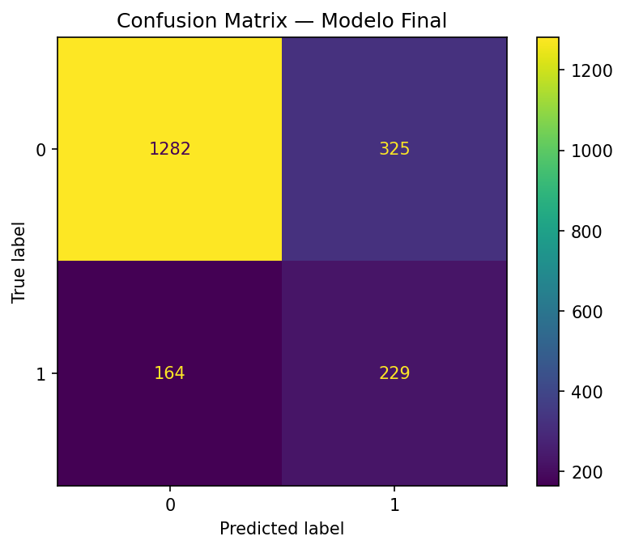
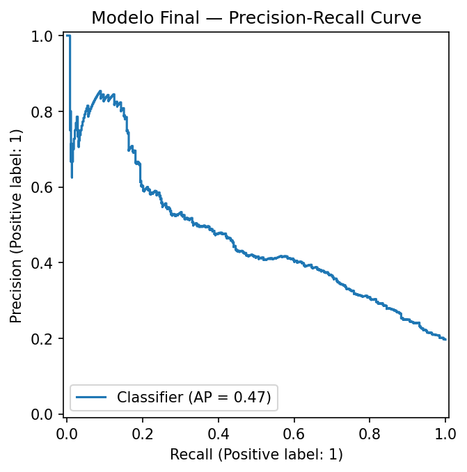

# 📊 Análise Individual — ChurnInsight (Dataset Bancário)
**Fábio Aguiar | Team Nexus | Hackathon ONE 2025**

Este documento descreve a análise individual realizada a partir do notebook:

```
notebooks/ds_experimentos_fabio_aguiar.ipynb
```

O objetivo desta etapa é **avaliar, interpretar e validar o modelo final de churn**, já treinado pelo pipeline oficial do projeto, focando em **comportamento preditivo, métricas e implicações de negócio**.

---

## Escopo da Análise

Esta análise **não altera** o pipeline oficial nem o contrato do projeto.  
Ela se concentra em:

- Avaliação pós-dump do modelo final (`Pipeline` completo)
- Interpretação de métricas clássicas de classificação
- Ajuste de threshold de decisão
- Geração de evidências visuais para documentação e apresentação

---

## Modelo Avaliado

- **Tipo:** Random Forest Classifier
- **Pipeline:** Pré-processamento + Modelo encapsulados em `Pipeline`
- **Artefato:**  
  ```
  artifacts/churn_model.joblib
  ```
- **Features internas:**
  - tenure
  - estimated_salary
  - products_number
  - credit_score
  - active_member
  - credit_card

---

## Avaliações Visuais

As imagens abaixo foram geradas automaticamente durante a etapa de pós-dump e estão disponíveis no diretório:

```
images/
```

### 🔹 Matriz de Confusão



**Interpretação técnica:**  
A matriz de confusão evidencia o trade-off clássico em problemas de churn. O modelo apresenta uma boa taxa de verdadeiros negativos (clientes que não cancelaram corretamente identificados), ao custo de um volume moderado de falsos positivos — clientes sinalizados como risco que, na prática, não cancelaram.  

Esse comportamento é **intencionalmente conservador**, priorizando a redução de falsos negativos (clientes que cancelam sem serem detectados), que costumam representar maior impacto financeiro em cenários de churn. Assim, o modelo tende a “errar para o lado da prevenção”, característica desejável em estratégias de retenção.

---

### 🔹 Curva ROC


- **AUC ≈ 0.75**

**Interpretação técnica:**  
A curva ROC indica que o modelo possui **boa capacidade discriminativa**, sendo capaz de separar, de forma consistente, clientes propensos a churn daqueles que tendem a permanecer. Um AUC de aproximadamente 0.75 demonstra que o modelo performa significativamente melhor do que uma classificação aleatória, mantendo um equilíbrio saudável entre sensibilidade e especificidade ao longo dos thresholds.

Esse resultado é compatível com um cenário realista de churn bancário, no qual há sobreposição natural entre os perfis de clientes.

---

### 🔹 Curva Precision–Recall



**Interpretação técnica:**  
A curva Precision–Recall reforça o comportamento do modelo em um contexto de **classe minoritária** (churn). Observa-se que, à medida que o recall aumenta — ou seja, mais clientes em churn são capturados — a precisão diminui, refletindo o aumento de falsos positivos.  

Essa relação evidencia que o modelo funciona melhor como um **ranker de risco**, permitindo priorizar clientes conforme a probabilidade estimada de evasão. O ajuste do threshold torna-se, portanto, um mecanismo estratégico para alinhar o modelo a diferentes políticas de retenção, como campanhas amplas ou ações seletivas de alto custo.


---

## Conclusões Técnicas

- O modelo apresenta desempenho consistente e realista para churn bancário
- A solução atua como **ranker de risco**, não como decisão binária rígida
- A análise pós-dump fortalece a rastreabilidade entre treino, inferência e uso prático

---

## Observações Finais

- Todo o código auxiliar está isolado em:
  ```
  utils/utils_data.py
  ```
- Nenhuma dependência foi introduzida no pipeline oficial
- Esta análise complementa a documentação técnica do projeto

---

**ChurnInsight — Análise Individual | Fábio Aguiar | Team Nexus**
